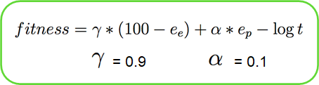
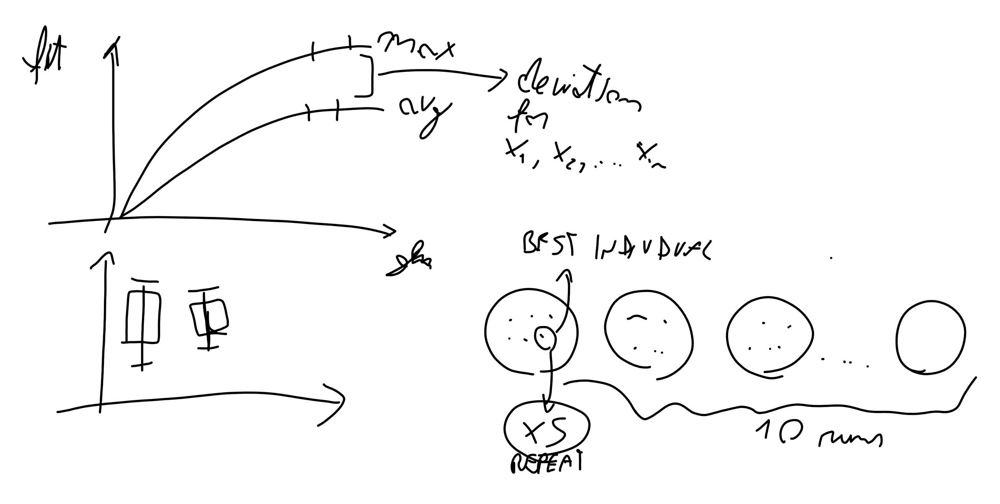
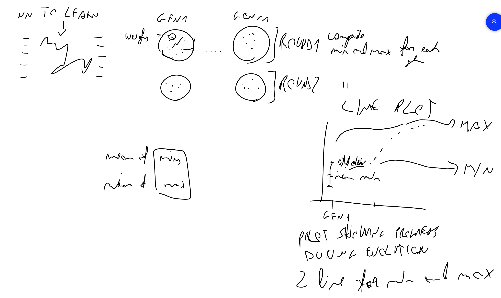
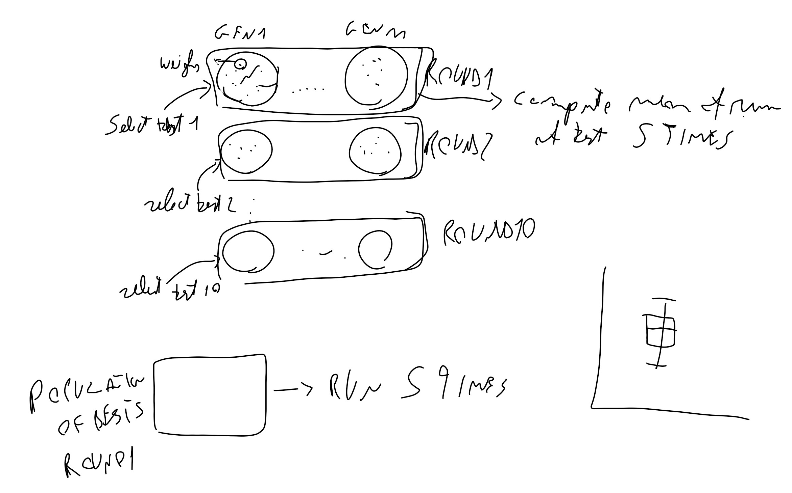

# Standard assignment 

### Lecture 2  - 09/09/21

We have 2 tasks to solve, which deadlines are respectively 1/10 and 18/10. 40% of the grade is first task, 60% is task 2.

Each task is based on a 2D game and we have to develop some EC strategies to solve both tasks.

**EvoMan** is a framework for the game *MegaMen* which involves a player and a enemy that fight each other. To win the game you have to defeat the enemy.

In this framework you have different modes of simulation:

- *individual evolution* is the mode that we have to use for task 1 and task 2. You have to design strategies for the player and fight against the enemy which is controlled in a standard way by the computer.

In *task 1* - You have to choose one kind of enemy and try to train you player to fight against this player.

In *task 2* - You have to put enemies one by one against the player and your evolution is fitted against all these enemies.

Other info about the game are:

- 8 kinds of enemies are available

- controller has to kill them all
- enemy will have static rules (no improvement for him)
- there 20 sensors in the game
  - 16 distance from player to projectile (8 projectile tops, 2 coordinates each)
  - 2 distance from player to enemy (2 coordinates)
  - 2 for direction of agents

#### Loops

You have 2 kinds of loop:

- *evolution loop*: in the game when one player make an action, the framework return some values for each sensor. Then controller calculate the fitness completely at the end of the game, when a stop criterion is reached

  

  where: 

  - $e_p$ means energy of the player
  - $e_e$ means energy of the enemy

  - $\log t$ is a penalty, and  $t$ is the time to finish and it is used to avoid the game to take too much time

- *iterations of the game*, loop in which each agent receive data from sensors and perform an action

#### Parameters

Don't change the following parameters in the framework, since they are needed to compare different agents in the same way:

- *level*=2,                
- *playermode* = "ai",        
- *enemymode* = "static",    
- *contacthurt* = "player"     

You can change:

- *experiment_name*: you need to set a name to differentiate your agent from others 
- *multiplemode*: no for task 1, yes for task 2
- *speed*, related to pygame, increases speed of evolution
- *sound*, turn this shit off bro
- *clockprecision*, pygame uses different kinds of *timing*, use *low* to avoid problems
- *randomini*: allow to have different position of enemies when the game start
- *timeexpire*: it is the timeout of the game, when you need to test high number of population it could be restrictive but is better to not change it

There's docs in `evoman1.0-doc.pdf` and you can find papers at `multi_evolution.pdf`

Reporting research on Canvas (Extra folder) might be useful to get inspirations about reports

#### Task 1

Design of 2 different EAs (completely separated!) using 3 or more enemies. Compare the two algorithms for the different enemies. 

#### Task 2

Choose 2 groups of enemies and combat. There's a competition (and two ranks), winners get 1 point, silver get 0.6, bronze get 0.3.

The second rank is represented by the **gain**, a comparison of the energies of player/enemy:
$$
g = \sum_{i=1}^n p_i - \sum_{i=1}^n e_i
$$

#### Report

Needs to be 3 page+1 for the cover (you can use one additional for the references), we have to use the GECCO template. 

- Introduction: try to make the goal and research **clear**, they need to see that we know what we're doing
- Methods: be brief.
- Results and discussions: discuss the results using some plots (why this part of plot is like this, why they're different...)
- Conclusions/Summary
- Literature: add everything you used.

"Budget" refers to the time needed to execute the experiments.

Be careful to not fill all the paper with the "method" section, you need to be as brief as possible.

#### Rules

- Do not use the EA code that's available in the repo (but inspiration is allowed)
- You **can** use libraries like DEAP 
- You can use the default fitness function, but you're not required to do so! It is allowed to change some parameters of the fitness function. 
- Do not make changes in the EVOMAN source code (they need comparable work)

- In EA there is some randomness so you have to repeat the experiments 10 times  to be sure about your results.

#### Plots

Two types of plot: 

- Max and average for the generations/fitness (fitness on Y, generations on Y)
- Comparison of two solutions (box plot) one box plot for solution
  - You have population for each solution
  - Select the best individual (there's randomness, so...)
  - Re-run the best individual

#### Tips

- Box plot using the results of different *populations* (select the best solution for each of the 10 independent runs, then test it 5 times)
- Do not use the EA demos
- The cleanest example is `dummy_demo.py`
- Everything you need is in the manual
- Reduce the plot size!
- Test algorithms using small populations (avoid starting with 100 generations!)
- Consider the experiments' time!
- Might be interesting to normalize the input of the controller (found in the default)
- Enable experiment recovery using `load_state()` and `save_state()`
- Review the baseline papers! Look for *Julian Togelius*

#### Execution

For each of 10 runs, you have one best solution. So you take it and test 5 times to test the deviation of each controller.

### Lecture 3 - 14/09/21

#### About Plots

There is a **neural network** called `demo_controller`in the project, which output are the actions like left, right, jump, etc..

The structure of the *neural network* is composed by 1 hidden layer in the middle which contain some **weights** supposed to be optimized. So the weights are supposed to be the the *individuals* of the population.

After the execution, you have to produce the following plots.

##### Line plot

The 1st plot show the evolution during each generation concerning the mean of the *min* and *max* value of the fitness for each generation. 

The mean is computed between the values of each round, because of some randomness in Evolutionary processes. The number of rounds should be 10.

There should be a plot for each enemy and one for each EA (2 in our case). The 3 enemy are chosen randomly. The 2 different EA can change also only in the parameters (increasing the mutation or disable something).

You can use mutation and crossover from DEAP library.

##### Box plot

For the 2nd plot you are supposed to draw box-plots.

You have to calculate the *best* value for run in each population (based on the fitness value)

Then you have a population of bests, and you have to select one best of them. You need to do this for each population in each run.

 

##### Environment

You can use *python3*. You need to change the file `tmx.py` at line 81, with `for c in list(tag)`.
